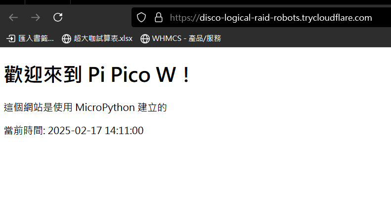

# 使用 MicroPython 在 Pi Pico W 上部屬 Web Server

本專案利用了 Pi Pico W 的 WIFI 模組構建了一個簡單的靜態網站
## 環境安裝

### MicroPython
先至 [MicroPython](https://micropython.org/download/RPI_PICO_W/) 的網站下載固件

按住板子上的Boot按鈕然後將USB插入電腦

將固件放入板子的硬碟中

### Thonny
至 [Thonny官網](https://thonny.org/) 下載並安裝 Thonny

將右下角的解釋器更改為板子的

## 部屬Web Server
選擇左上角檔案 >> 開啟舊檔 >> 選擇專案的main.py

填入wifi名稱和密碼

點擊上方的運行

現在網站應該成功部屬在內網了

將網址輸入瀏覽器就能查看

> [!NOTE]  
> HTML的內容都能自行更改

## 內網穿透
我們可以使用 Cloudflared Tunnel 來構建免費的內網穿透

在 CMD 輸入 `winget install --id Cloudflare.cloudflared` 來下載 Cloudflared

下載後在 CMD 輸入 `cloudflared tunnel --url http://你的內網ip:80`

他就會給你一個臨時的網址能夠訪問內網服務

這樣我們就能在外網看到我們的網站了

## 實例
- `main.py`
    - 簡單靜態網頁，顯示當前時間
    
- `webhook.py`
    - 可以從網站上發送discord webhook(需填入webhook url)

- `gemini.py`
    - 可以從網站上對Gemini API發送請求(需填入API KEY [教學](https://github.com/imyimang/discord-gemini-chat-bot/blob/main/docs/zh/q2.md))

> [!WARNING]  
> 由於MicroPython不支援urllib.parse，上述兩種實例都僅能發送ascii表內的文字
